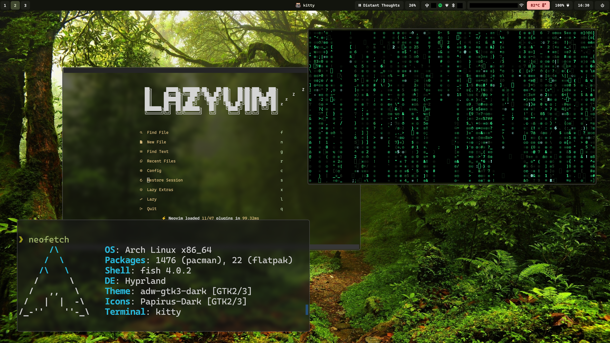
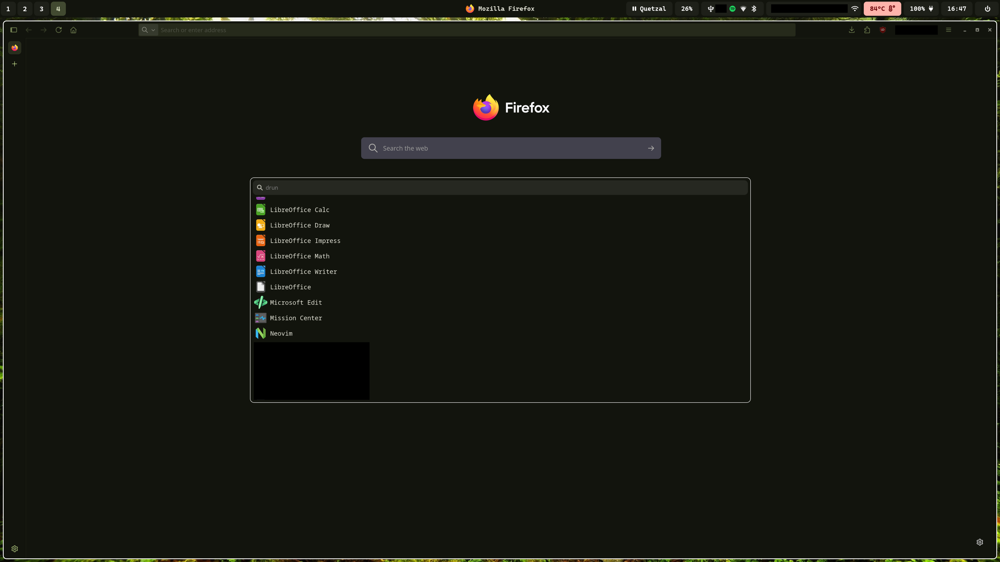

# Welcome to my Arch Linux .dotfiles

Hey! Welcome to my dotfiles powered by Arch Linux running Hyprland.

In this repo you'll find all my personal config-files.

## Software

| Component       | Software              |
| --------------- | --------------------- |
| 🪟 WM           | Hyprland              |
| ⌨️ Terminal     | Kitty                 |
| 📶 Bar          | Waybar                |
| 🔎 App Picker   | Wofi                  |
| 🐚 Shell        | Fish                  |
| ✨ Shell Prompt | Starship              |
| ✏️ Editor       | NVim                  |
| 🌐 Browser      | Firefox with Pywalfox |
| 🎨 Colors       | Matugen               |

## Screenshots

Desktop:

Browser + App Picker

## Setup

You can setup these dotfiles using chezmoi.
